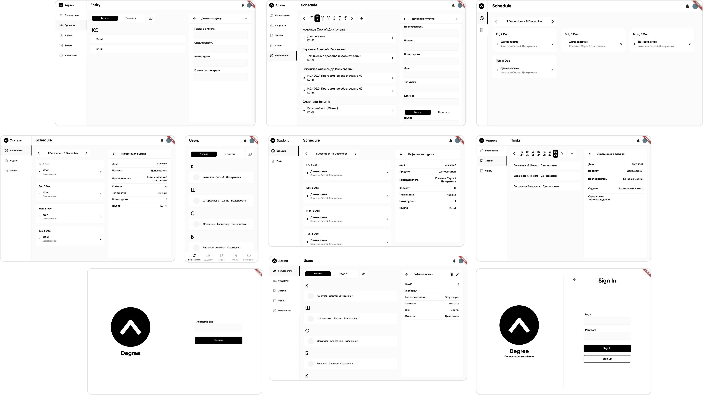

# Pet project Degree

<p align="center">
  
</p>

# Test(WEB) https://degree.serezhia.ru

# About Degree.Student, Degree.Admin...

Cross-platform application for schedule view (schedule changes via notifications), creation and tracking of tasks, news

# Stack

Flutter/Dart, Bloc(cubit) - cross-platform frontend 

Shelf/Dart - webservers

PostgreSQL - backend db

# Init run

```
soon
```

# Design

<p align="center">
  
</p>